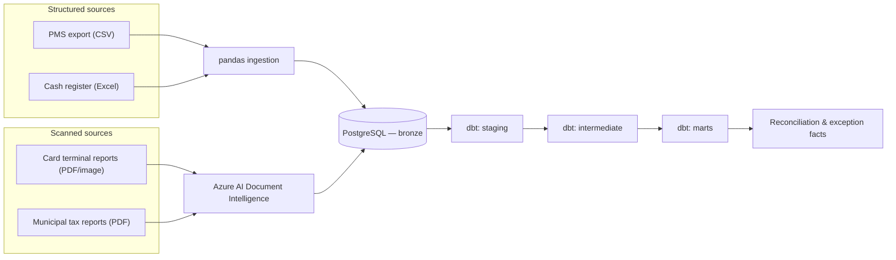

# Revenue Reconciliation Engine

A reconciliation pipeline that cross-checks a hotel's revenue across four independent
source systems — property management (PMS), daily cash register, card payment
terminal, and municipal tourist tax reporting — to flag what was billed, what was
registered, and what was actually received, and surface the gaps between them.

## The problem

A hotel's real revenue picture is never in one place. The PMS records what was
billed to a guest. The daily cash register records what was physically taken in.
The card terminal (TPA) records what the payment network actually settled. The
municipal tourist tax report records what was declared to the local authority for
accommodation and bar revenue. These four numbers *should* reconcile for any given
period — in practice they don't always, and the gap is exactly where billing errors,
missed charges, and reporting mistakes hide.

This project treats that gap as the deliverable: not just importing four sources into
one database, but building the validation and comparison logic that turns "four
spreadsheets that don't quite agree" into a small number of concrete, explainable
exceptions.

## Why two sources need OCR and two don't

PMS exports and cash register logs arrive as structured files (CSV, Excel) — they can
be read directly with pandas. The card terminal and municipal tax reports don't: they
exist only as **scanned receipts and printed reports**, with no underlying structured
export. Those two sources are ingested through Azure AI Document Intelligence, which
extracts structured fields (date, amount, terminal ID, transaction reference) from the
scanned document before it ever reaches the same normalization and validation logic
the other two sources go through.

## What's in this repo

| Doc | Covers |
|---|---|
| [`architecture.md`](docs/architecture.md) | The four ingestion paths and how they converge |
| [`business_problem.md`](docs/business_problem.md) | Why reconciliation matters and what "done" looks like |
| [`source_system_analysis.md`](docs/source_system_analysis.md) | What each of the four sources actually contains, and its quirks |
| [`data_dictionary.md`](docs/data_dictionary.md) | The canonical fields every source is normalized onto |
| [`reconciliation_rules.md`](docs/reconciliation_rules.md) | How a match, a mismatch, and a missing transaction are each defined |
| [`data_quality.md`](docs/data_quality.md) | Validation rules and how failures are surfaced, not swallowed |
| [`decisions/`](docs/decisions/) | Short ADRs for the trade-offs that mattered most |

## Stack

Python, pandas, NumPy · Azure AI Document Intelligence · PostgreSQL · dbt (staging →
intermediate → marts) · pytest.

## Status

Structure, documentation, and interfaces are in place; source-specific parsing and
reconciliation logic are being implemented incrementally. Code files exist as typed
scaffolding (signatures, docstrings, no data) ahead of that work — see each module's
docstring for what it's responsible for.

---

Sample data under `data/sample/` is synthetic. Real source exports are never
committed to this repository — see [`data_quality.md`](docs/data_quality.md) for how
raw files are handled locally.
