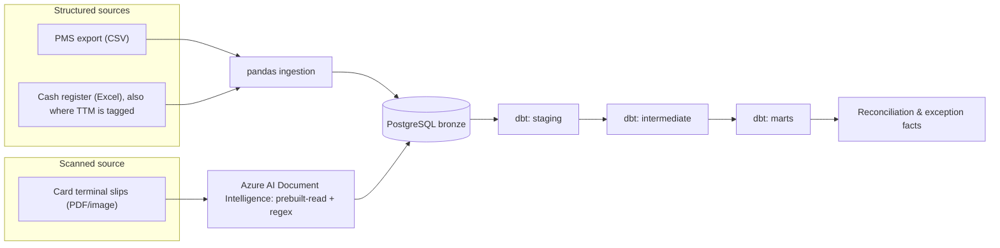

# Revenue Reconciliation Engine

[](https://github.com/franciscovmcunha/revenue-reconciliation-engine/actions/workflows/ci.yml)

A reconciliation pipeline that cross-checks a hotel's revenue across three independent
source systems (property management/PMS, daily cash register, and card payment
terminal) to flag what was billed, what was registered, and what was actually
received, and surface the gaps between them.

## The problem

A hotel's real revenue picture is never in one place. The PMS records what was
billed to a guest. The daily cash register records what was physically taken in.
The card terminal (TPA) records what the payment network actually settled. These
three numbers *should* reconcile for any given period. In practice they don't
always, and the gap is exactly where billing errors, missed charges, and reporting
mistakes hide.

This project treats that gap as the deliverable: not just importing three sources
into one database, but building the validation and comparison logic that turns
"three spreadsheets that don't quite agree" into a small number of concrete,
explainable exceptions.

Municipal tourist tax (TTM) isn't a fourth source here (confirmed after inspecting
the real files). A cash TTM payment shows up as a tagged row inside the cash
register's own data; paid any other way, it's folded into the PMS invoice with
nothing separate to extract. See
[`source_system_analysis.md`](docs/source_system_analysis.md) for the full finding.

## Why one source needs OCR and two don't

PMS exports and cash register logs arrive as structured files (CSV, Excel) that can
be read directly with pandas. The card terminal doesn't: it exists only as **scanned,
printed terminal slips**, with no underlying structured export. That source is
ingested through Azure AI Document Intelligence, not as structured field extraction
though, since a real slip has no table or form to segment (and one scanned page can
hold several independent daily slips). It runs OCR (`prebuilt-read`) and parses the
result with a regex against the slip's fixed labels. See
[`decisions/0002-document-intelligence-for-scanned-sources.md`](docs/decisions/0002-document-intelligence-for-scanned-sources.md).



## What's in this repo

| Doc | Covers |
|---|---|
| [`architecture.md`](docs/architecture.md) | The three ingestion paths and how they converge |
| [`business_problem.md`](docs/business_problem.md) | Why reconciliation matters and what "done" looks like |
| [`source_system_analysis.md`](docs/source_system_analysis.md) | What each of the three sources actually contains, its quirks, and the municipal-tax finding |
| [`data_dictionary.md`](docs/data_dictionary.md) | The canonical fields every source is normalized onto |
| [`reconciliation_rules.md`](docs/reconciliation_rules.md) | How a match, a mismatch, and a missing transaction are each defined, including the TTM and inter-property-deposit exceptions |
| [`data_quality.md`](docs/data_quality.md) | Validation rules and how failures are surfaced, not swallowed |
| [`decisions/`](docs/decisions/) | Short ADRs for the trade-offs that mattered most |

## Stack

Python, pandas, NumPy · Azure AI Document Intelligence · PostgreSQL · dbt (staging →
intermediate → marts) · pytest.

## Running this project

```bash
python3 -m venv .venv && source .venv/bin/activate
pip install -r requirements.txt

python -m pytest tests/ -v          # fast tests only; see pyproject.toml for markers

cp .env.example .env                 # fill in your own Postgres + Azure credentials
cp dbt/profiles.yml.example dbt/profiles.yml   # if you don't already have one

# no real data on hand? scripts/ci_bronze_fixture.sql loads a small synthetic
# bronze dataset directly, so dbt can be exercised without any source files:
psql "$POSTGRES_DB" -f scripts/ci_bronze_fixture.sql
export DBT_PROFILES_DIR=dbt
dbt build --target ci
```

## Status

Every layer is implemented: ingestion for all three sources, and the full
staging → intermediate → marts dbt build, producing real matched/mismatch/missing
outcomes. Verified locally against the real PMS and cash register exports (776
canonical rows, 561 reconciliation comparisons) and against a synthetic fixture
covering every outcome (`scripts/ci_bronze_fixture.sql`, what CI runs against).
Card terminal ingestion needs a live Azure Document Intelligence call per slip;
this account's free-tier OCR quota is currently exhausted, so most real card
terminal data hasn't been backfilled yet, which `fact_missing_transactions`
correctly and visibly reflects rather than hiding.

---

Sample data under `data/sample/` is synthetic. Real source exports are never
committed to this repository. See [`data_quality.md`](docs/data_quality.md) for how
raw files are handled locally.

---

**Francisco Cunha** · Data Engineer / Analytics Engineer · [LinkedIn](https://linkedin.com/in/franciscovmcunha)
