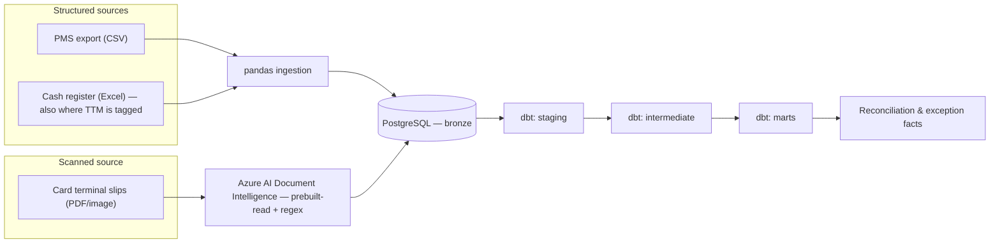

# Revenue Reconciliation Engine

A reconciliation pipeline that cross-checks a hotel's revenue across three independent
source systems — property management (PMS), daily cash register, and card payment
terminal — to flag what was billed, what was registered, and what was actually
received, and surface the gaps between them.

## The problem

A hotel's real revenue picture is never in one place. The PMS records what was
billed to a guest. The daily cash register records what was physically taken in.
The card terminal (TPA) records what the payment network actually settled. These
three numbers *should* reconcile for any given period — in practice they don't
always, and the gap is exactly where billing errors, missed charges, and reporting
mistakes hide.

This project treats that gap as the deliverable: not just importing three sources
into one database, but building the validation and comparison logic that turns
"three spreadsheets that don't quite agree" into a small number of concrete,
explainable exceptions.

Municipal tourist tax (TTM) isn't a fourth source here — confirmed after inspecting
the real files. A cash TTM payment shows up as a tagged row inside the cash
register's own data; paid any other way, it's folded into the PMS invoice with
nothing separate to extract. See
[`source_system_analysis.md`](docs/source_system_analysis.md) for the full finding.

## Why one source needs OCR and two don't

PMS exports and cash register logs arrive as structured files (CSV, Excel) — they can
be read directly with pandas. The card terminal doesn't: it exists only as **scanned,
printed terminal slips**, with no underlying structured export. That source is
ingested through Azure AI Document Intelligence — not as structured field extraction,
though, since a real slip has no table or form to segment (and one scanned page can
hold several independent daily slips). It runs OCR (`prebuilt-read`) and parses the
result with a regex against the slip's fixed labels — see
[`decisions/0002-document-intelligence-for-scanned-sources.md`](docs/decisions/0002-document-intelligence-for-scanned-sources.md).

## What's in this repo

| Doc | Covers |
|---|---|
| [`architecture.md`](docs/architecture.md) | The three ingestion paths and how they converge |
| [`business_problem.md`](docs/business_problem.md) | Why reconciliation matters and what "done" looks like |
| [`source_system_analysis.md`](docs/source_system_analysis.md) | What each of the three sources actually contains, its quirks, and the municipal-tax finding |
| [`data_dictionary.md`](docs/data_dictionary.md) | The canonical fields every source is normalized onto |
| [`reconciliation_rules.md`](docs/reconciliation_rules.md) | How a match, a mismatch, and a missing transaction are each defined, including the TTM and inter-property-deposit exceptions |
| [`data_quality.md`](docs/data_quality.md) | Validation rules and how failures are surfaced, not swallowed |
| [`decisions/`](docs/decisions/) | Short ADRs for the trade-offs that mattered most |

## Stack

Python, pandas, NumPy · Azure AI Document Intelligence · PostgreSQL · dbt (staging →
intermediate → marts) · pytest.

## Status

Structure, documentation, and interfaces are in place; source-specific parsing and
reconciliation logic are being implemented incrementally. Code files exist as typed
scaffolding (signatures, docstrings, no data) ahead of that work — see each module's
docstring for what it's responsible for.

---

Sample data under `data/sample/` is synthetic. Real source exports are never
committed to this repository — see [`data_quality.md`](docs/data_quality.md) for how
raw files are handled locally.
